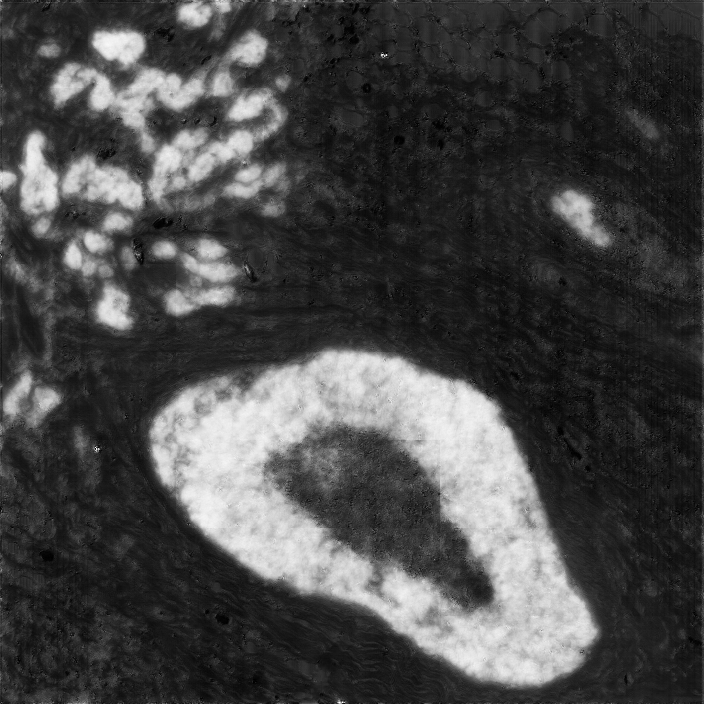
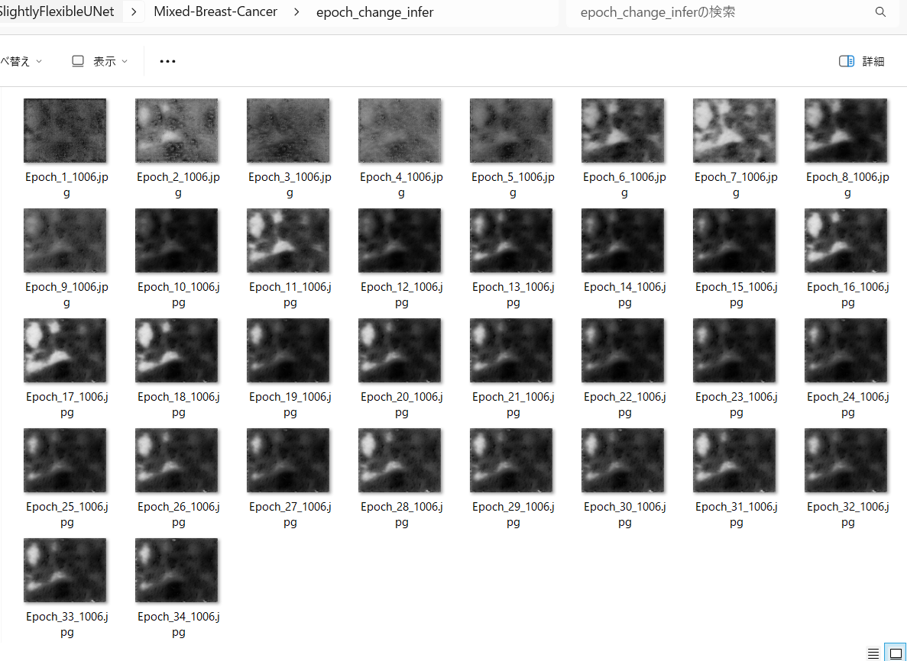
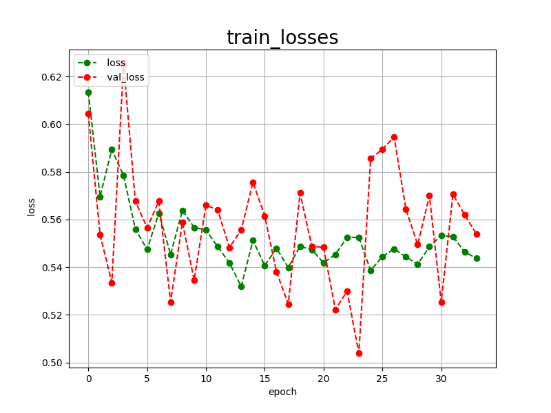
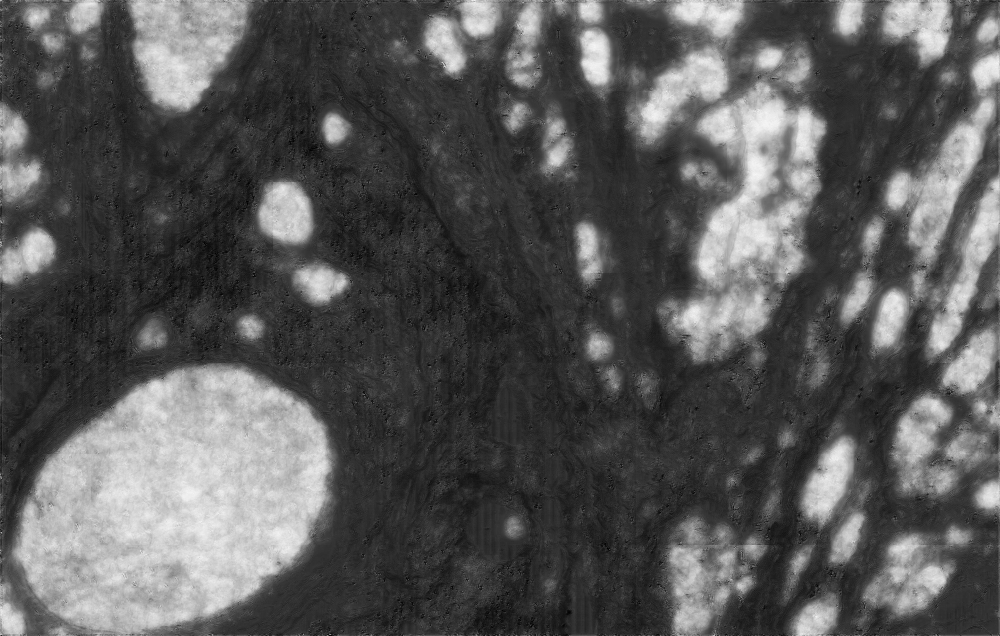

<h2>Tensorflow-Tiled-Image-Segmentation-Augmented-Breast-Cancer-Histopathological-Images (Updated: 2024/06/09)</h2>
<li>2023/06/09: Updated <a href="./src/TensorflowUNetTrainer.py">TensorflowTrainder.py</a> to add EarlyStoppingCallback to the last in a callbacklist.</li>
<li>2023/06/09: Updated <a href="./projects/TensorflowSlightlyFlexibleUNet/Mixed-Breast-Cancer/train_eval_infer.config">train_eval_infer.config</a>
 to improve a segmetation accuracy.</li>

This is the first experiment of Tiled Image Segmentation for Breast Cancer Histopathological Images based on
the <a href="https://github.com/sarah-antillia/Tensorflow-Image-Segmentation-API">Tensorflow-Image-Segmentation-API</a>, and
Mixed-Breast-Cancer-ImageMask-Dataset 
<a href="https://drive.google.com/file/d/1tkGpCrHGIzzFKjrPhBQ4j1BOKbYGbGO0/view?usp=sharing">Mixed-Breast-Cancer-ImageMask-Dataset-M2.zip</a>
, which was derived by us from <a href="https://github.com/PathologyDataScience/BCSS">
Breast Cancer Semantic Segmentation (BCSS) dataset
</a>
  
On <b>Mixed-Breast-Cancer-ImageMask-Dataset</b>, please refer to <a href="https://github.com/sarah-antillia/Tiled-ImageMask-Dataset-Breast-Cancer">
Tiled-ImageMask-Dataset-Breast-Cancer</a> 
  
In this experiment, we employed the following strategy: 
<b>
 
1. We trained and validated a TensorFlow UNet model using the Mixed-Breast-Cancer-ImageMask-Dataset, which was tiledly-split to 512x512
 and reduced to 512x512 image and mask dataset. 
2. We applied the Tiled-Image Segmentation inference method to predict the breast-cancer (tumor) regions for the test images 
with a resolution of 2K or 7K pixels. 
  
</b>  

<b>Actual Image Segmentation for 4096x4096 images.</b> 
As shown below, the predicted mask seems to be blurry compared with the ground_truth mask. 
Please see also our experiment <a href="https://github.com/sarah-antillia/Tensorflow-Image-Segmentation-Breast-Cancer-Histopathological-Images">
Tensorflow-Image-Segmentation-Breast-Cancer-Histopathological-Images</a> based on Non-Tiled-Breast-Cancer-ImageMask-Dataset.
   
<table>
<tr>
<th>Input: image</th>
<th>Mask (ground_truth)</th>
<th>Prediction: tiled_inferred_mask</th>
</tr>
<tr>
<td></td>

<td></td>
<td></td>
</tr>

<tr>
<td></td>

<td></td>
<td></td>
</tr>
</table>

 
In this experiment, we used the simple UNet Model 
<a href="./src/TensorflowUNet.py">TensorflowSlightlyFlexibleUNet</a> for this Breast Cancer Segmentation. 
As shown in <a href="https://github.com/sarah-antillia/Tensorflow-Image-Segmentation-API">Tensorflow-Image-Segmentation-API</a>.
you may try other Tensorflow UNet Models: 

<li><a href="./src/TensorflowSwinUNet.py">TensorflowSwinUNet.py</a></li>
<li><a href="./src/TensorflowMultiResUNet.py">TensorflowMultiResUNet.py</a></li>
<li><a href="./src/TensorflowAttentionUNet.py">TensorflowAttentionUNet.py</a></li>
<li><a href="./src/TensorflowEfficientUNet.py">TensorflowEfficientUNet.py</a></li>
<li><a href="./src/TensorflowUNet3Plus.py">TensorflowUNet3Plus.py</a></li>
<li><a href="./src/TensorflowDeepLabV3Plus.py">TensorflowDeepLabV3Plus.py</a></li>

 

<h3>1. Dataset Citation</h3>
The original dataset used here has been taken from the following github repository. 

<a href="https://github.com/PathologyDataScience/BCSS">
Breast Cancer Semantic Segmentation (BCSS) dataset
</a>
 
 
On detail of this dataset, please refer to the following paper. 

<a href="https://academic.oup.com/bioinformatics/article/35/18/3461/5307750?login=false">
 

<b>Structured crowdsourcing enables convolutional segmentation of histology images</b> 
</a> 
Bioinformatics, Volume 35, Issue 18, September 2019, Pages 3461–3467,  
https://doi.org/10.1093/bioinformatics/btz083 
Published: 06 February 2019 

Mohamed Amgad, Habiba Elfandy, Hagar Hussein, Lamees A Atteya, Mai A T Elsebaie, Lamia S Abo Elnasr,  
Rokia A Sakr, Hazem S E Salem, Ahmed F Ismail, Anas M Saad, Joumana Ahmed, Maha A T Elsebaie,  
Mustafijur Rahman, Inas A Ruhban, Nada M Elgazar, Yahya Alagha, Mohamed H Osman, Ahmed M Alhusseiny,  
Mariam M Khalaf, Abo-Alela F Younes, Ali Abdulkarim, Duaa M Younes, Ahmed M Gadallah, Ahmad M Elkashash,  
Salma Y Fala, Basma M Zaki, Jonathan Beezley, Deepak R Chittajallu, David Manthey, 
David A Gutman, Lee A D Cooper 

 
<b>Dataset Licensing</b> 
This dataset itself is licensed under a CC0 1.0 Universal (CC0 1.0) license. 

 

<h3>
<a id="2">
2 Breast Cancer ImageMask Dataset
</a>
</h3>
 If you would like to train this Breast-Cancer Segmentation model by yourself,please down load the dataset 
Mixed-Breast-Cancer-ImageMask-Dataset from the google drive
<a href="https://drive.google.com/file/d/1tkGpCrHGIzzFKjrPhBQ4j1BOKbYGbGO0/view?usp=sharing">
Mixed-Breast-Cancer-ImageMask-Dataset-M2.zip.</a>
. 

 
Please expand the downloaded ImageMaskDataset and place them under <b>./dataset</b> folder to be
<pre>
./dataset
└─Mixed-Breast-Cancer
    ├─test
    │   ├─images
    │   └─masks
    ├─train
    │   ├─images
    │   └─masks
    └─valid
        ├─images
        └─masks
</pre>
 

<b>Breast Cancer Dataset Statistics</b> 
 
 
As shown above, the number of images of train and valid dataset is not necessarily large. 
Therefore, an online dataset augmentation 
strategy to train this Breast-Cancer model may be effective to get a better trained model.
 

 
<b>Train_images_sample</b> 

 
<b>Train_masks_sample</b> 

 

<h3>
4 Train TensorflowUNet Model
</h3>
 We have trained Breast-Cancer TensorflowUNet Model by using the following
<a href="./projects/TensorflowSlightlyFlexibleUNet/Mixed-Breast-Cancer/train_eval_infer.config"> <b>train_eval_infer.config</b></a> file  
, in which <b>generator</b> parameter setting in [model] section is <b>True</b> which enables to train TensorflowUNet model by the
online augmentor <a href="./src/ImageMaskAugmentor.py">ImageMaskAugmentor</a>.
 
<pre>
[model]
generator     = True
</pre>
Please move to ./projects/Mixed-Breast-Cancer and run the following bat file. 
<pre>
>1.train.bat
</pre>
This bat file simply runs the following command.
<pre>
>python ../../../src/TensorflowUNetTrainer.py ./train_eval_infer.config
</pre>
<pre>
; train_eval_infer.config
; 2024/06/09 (C) antillia.com

[model]
model         = "TensorflowUNet"
generator     = True
image_width    = 512
image_height   = 512
image_channels = 3
input_normalize = False
num_classes    = 1
base_filters   = 16
base_kernels   = (7,7)
normalization  = True
num_layers     = 7
dropout_rate   = 0.07
learning_rate  = 0.00008
clipvalue      = 0.5
dilation       = (1,1)
loss           = "bce_dice_loss"
metrics        = ["binary_accuracy"]
show_summary   = False

[train]
epochs         = 50
batch_size     = 2
steps_per_epoch  = 300
validation_steps = 80
patience       = 10
;metrics       = ["iou_coef", "val_iou_coef"]
metrics        = ["binary_accuracy", "val_binary_accuracy"]
model_dir      = "./models"
eval_dir       = "./eval"
image_datapath = "../../../dataset/Mixed-Breast-Cancer/train/images/"
mask_datapath  = "../../../dataset/Mixed-Breast-Cancer/train/masks/"
create_backup  = False

;Infer mask region on epoch_changed
epoch_change_infer     = True
; Output dir to save the infered masks
epoch_change_infer_dir =  "./epoch_change_infer"

;Tiled-infer mask region on epoch_changed
epoch_change_tiledinfer     = True
; Output dir to save the tiled-infered masks
epoch_change_tiledinfer_dir =  "./epoch_change_tiledinfer"

; The number of the images to on epoch_change
num_infer_images       = 1

learning_rate_reducer = True
reducer_factor        = 0.3
reducer_patience      = 4

save_weights_only = True

[eval]
image_datapath = "../../../dataset/Mixed-Breast-Cancer/valid/images/"
mask_datapath  = "../../../dataset/Mixed-Breast-Cancer/valid/masks/"

[test] 
image_datapath = "../../../dataset/Mixed-Breast-Cancer/test/images/"
mask_datapath  = "../../../dataset/Mixed-Breast-Cancer/test/masks/"

[infer] 
images_dir    = "./mini_test/images"
output_dir    = "./mini_test_output"
;merged_dir   = "./mini_test_output_merged"
;binarize      = True
sharpening   = True

[tiledinfer] 
overlapping = 128
images_dir  = "./mini_test/images"
output_dir  = "./tiled_mini_test_output"
; default bitwise_blending is True
bitwise_blending =False
;binarize      = True
;sharpening   = True
;merged_dir  = "./tiled_mini_test_output_merged"

[segmentation]
colorize      = False
black         = "black"
white         = "green"
blursize      = None

[mask]
blur      = False
blur_size = (3,3)
binarize  = False
threshold = 180

[generator]
debug         = False
augmentation  = True

[augmentor]
vflip    = True
hflip    = True
rotation = True
angles   = [60, 120, 180, 240, 300]
shrinks  = [0.6, 0.8]
shears   = [0.1]
deformation = True
distortion  = True

[deformation]
alpah    = 1300
sigmoid  = 8

[distortion]
gaussian_filter_rsigma= 40
gaussian_filter_sigma = 0.5
distortions           = [0.03]
</pre>
In this configuration file above, we modifed <b>base_kernel</b> size to become larger than the former experiment. 
<pre>
[train]
base_kernels = (7,7)
;base_kernels = (5,5)
</pre>
As before, we also added the following parameters to enable <b>epoch_change_infer</b> and 
<b>epoch_change_tiledinfer</b> callbacks in [train] section. 
<pre>
[train]
;Inference execution flag on epoch_changed
epoch_change_infer     = True
; Output dir to save the infered masks on epoch_changed
epoch_change_infer_dir =  "./epoch_change_infer"

;Tiled-inference execution flag on epoch_changed
epoch_change_tiledinfer     = True
; Output dir to save the tiled-infered masks on epoch_changed
epoch_change_tiledinfer_dir =  "./epoch_change_tiledinfer"

; The number of the images to be inferred on epoch_changed.
num_infer_images       = 1
</pre>
 
By using these callbacks, on every epoch_change, the non-tiled ordinary inference and tiled-inference procedures can be called
 for an image in <b>mini_test</b> folder.  
<b>Epoch_change_inference output</b> 
 

<b>Epoch_change_tiled_inference output</b> 
 
 
These inferred masks outputs on_epch_change will be helpful to examine the parameters for training of the configuration file. 
   
The training process has been stopped at epoch 34 by an early-stopping callback.  
 
 
 
<a href="./projects/TensorflowSlightlyFlexibleUNet/Mixed-Breast-Cancer/eval/train_metrics.csv">train_metrics.csv</a> 
 

 
<a href="./projects/TensorflowSlightlyFlexibleUNet/Mixed-Breast-Cancer/eval/train_losses.csv">train_losses.csv</a> 
 

 

<h3>
5 Evaluation
</h3>
Please move to a <b>./projects/TensorflowSlightlyFlexibleUNet/Mixed-Breast-Cancer</b> folder, 
and run the following bat file to evaluate TensorflowUNet model for Breast-Cancer. 
<pre>
./2.evaluate.bat
</pre>
This bat file simply runs the following command.
<pre>
python ../../../src/TensorflowUNetEvaluator.py ./train_eval_infer.config
</pre>
Evaluation console output: 

  
<a href="./projects/TensorflowSlightlyFlexibleUNet/Mixed-Breast-Cancer/evaluation.csv">evaluation.csv</a> 
The loss (bce_dice_loss) and accuracy for this test dataset became slightly better than the former experiment as shown below. 
This experiment evaluation result: 
<pre>
loss,0.4929
binary_accuracy,0.7151
</pre>
The former experimant evaluation result: 
<pre>
loss,0.5309
binary_accuracy,0.6921
</pre>
 
<h3>
6 Inference
</h3>
Please move to a <b>./projects/TensorflowSlightlyFlexibleUNet/Mixed-Breast-Cancer</b> folder
, and run the following bat file to infer segmentation regions for the images 
in <a href="./projects/TensorflowSlightlyFlexibleUNet/Mixed-Breast-Cancer/mini_test/images"><b>mini_test/images</b></a> by the Trained-TensorflowUNet model for Breast-Cancer. 
<pre>
./3.infer.bat
</pre>
This bat file simply runs the following command.
<pre>
python ../../../src/TensorflowUNetInferencer.py ./train_eval_infer_aug.config
</pre>
The <a href="./projects/TensorflowSlightlyFlexibleUNet/Mixed-Breast-Cancer/mini_test/"><b>mini_test</b></a>
folder contains some large image and mask files taken from the original BCSS dataset.  

<b>mini_test_images</b> 
 
 
<b>mini_test_mask(ground_truth)</b> 
 
 
<b>Inferred test masks</b> 
 
 

<h3>
7 Tiled Inference
</h3>
Please move to a <b>./projects/TensorflowSlightlyFlexibleUNet/Mixed-Breast-Cancer</b> folder 
,and run the following bat file to infer segmentation regions for images by the Trained-TensorflowUNet model for Breast-Cancer. 
<pre>
./4.infer_tiles.bat
</pre>
This bat file simply runs the following command. 
<pre>
python ../../../src/TensorflowUNetTiledInferencer.py ./train_eval_infer.config
</pre>

 
<b>Tiled inferred test masks</b> 
 
 

<b>Enlarged Masks Comparison</b> 

<table>
<tr>
<th>Image</th>
<th>Mask (ground_truth)</th>
<th>Tiled-inferred-mask</th>
</tr>

<tr>
<td></td>
<td></td>
<td></td>
</tr>

<tr>
<td></td>
<td></td>
<td></td>
</tr>

<tr>
<td></td>
<td></td>
<td></td>
</tr>

<tr>
<td></td>
<td></td>
<td></td>
</tr>

<tr>
<td></td>
<td></td>
<td></td>
</tr>

</table>
 

<h3>
References
</h3>
<b>1. Structured crowdsourcing enables convolutional segmentation of histology images</b> 
Bioinformatics, Volume 35, Issue 18, September 2019, Pages 3461–3467,  
https://doi.org/10.1093/bioinformatics/btz083 
Published: 06 February 2019 

Mohamed Amgad, Habiba Elfandy, Hagar Hussein, Lamees A Atteya, Mai A T Elsebaie, Lamia S Abo Elnasr,  
Rokia A Sakr, Hazem S E Salem, Ahmed F Ismail, Anas M Saad, Joumana Ahmed, Maha A T Elsebaie,  
Mustafijur Rahman, Inas A Ruhban, Nada M Elgazar, Yahya Alagha, Mohamed H Osman, Ahmed M Alhusseiny,  
Mariam M Khalaf, Abo-Alela F Younes, Ali Abdulkarim, Duaa M Younes, Ahmed M Gadallah, Ahmad M Elkashash,  
Salma Y Fala, Basma M Zaki, Jonathan Beezley, Deepak R Chittajallu, David Manthey, 
David A Gutman, Lee A D Cooper 

<pre>
https://academic.oup.com/bioinformatics/article/35/18/3461/5307750?login=false
</pre>
 
<b>2. Breast Cancer Histopathological Images Segmentation Using Deep Learning</b> 
Wafaa Rajaa Drioua, Nacéra Benamrane and Lakhdar Sais 
Sensors 2023, 23(17), 7318; https://doi.org/10.3390/s2317318 
<pre>
https://www.mdpi.com/1424-8220/23/17/7318
</pre>
 

<b>3. Exact Tile-Based Segmentation Inference for Images Larger than GPU Memory</b> 
Volume 126, Article No. 126009 (2021) https://doi.org/10.6028/jres.126.009 
 Journal of Research of National Institute of Standards and Technology 
Michael Majurski and Peter Bajcsy 
<pre>
https://nvlpubs.nist.gov/nistpubs/jres/126/jres.126.009.pdf
</pre>
 
<b>4. Mixed-ImageMask-Dataset-Breast-Cancer</b> 
Toshyuki Arai @antillia.com 
<pre>
https://github.com/sarah-antillia/Mixed-ImageMask-Dataset-Breast-Cancer
</pre>

 
<b>5. Tensorflow-Image-Segmentation-Breast-Cancer-Histopathological-Images</b> 
Toshyuki Arai @antillia.com 
<pre>
https://github.com/sarah-antillia/Tensorflow-Image-Segmentation-Breast-Cancer-Histopathological-Images
<pre>

